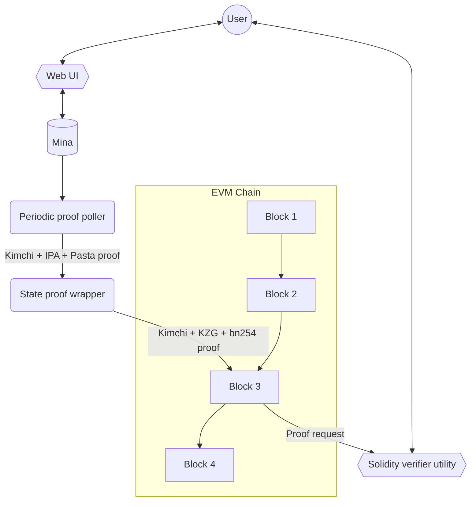

<div align="center">

# mina_bridge 🌉

### Zero-knowledge state bridge from Mina to Ethereum

</div>

## About

This project introduces the proof generation, posting and verification of the validity of [Mina](https://minaprotocol.com/) states into a EVM chain, which will serve as a foundation for token bridging.

## Design objectives

`mina_bridge` will include:

1. Backend service for periodically wrapping and posting Mina state proofs to an EVM chain.
2. A “wrapping” module for Mina state proofs to make them efficient to verify on the EVM.
3. The solidity logic for verifying the wrapped Mina state proofs on a EVM chain.
4. Browser utility for smart contract users: Mina address is provided as an input. State is looked up against Mina and then shared as a Mina state lookup-merkle-proof wrapped inside an efficient proof system.
5. A solidity contract utility that smart contract developers or users can execute on an EVM chain to feed in a Mina state lookup proof that will check the state lookup against the latest posted Mina state proof to verify that this Mina state is valid.

## Disclaimer

`mina_bridge` is in an early stage of development, currently it misses elemental features and correct functionality is not guaranteed.

## Architecture

This is subject to change.



## Components of this Repo

This repository is composed of the following components:

### Verifier circuit

This module contains the [o1js](https://github.com/o1-labs/o1js) circuit used for recursively verify Mina state proofs.
A proof of the circuit will be constructed in subsequent modules for validating the state.

The code is written entirely in Typescript using the [o1js](https://github.com/o1-labs/o1js) library and is heavily based on [Kimchi](https://github.com/o1-labs/proof-systems/tree/master/kimchi)'s original verifier implementation.

## Running
On `verifier_circuit/` run:
```sh
make
```
This will create the constraint system of the verification of a proof with fixed values.
This will also clone the Monorepo version of Mina so that the bridge uses o1js from there.

## Testing
```bash
npm run test
npm run testw # watch mod
```
will execute Jest unit and integration tests of the module.

## Structure

- `poly_commitment/`: Includes the `PolyComm` type and methods used for representing a polynomial commitment.
- `prover/`: Proof data and associated methods necessary to the verifier. The Fiat-Shamir heuristic is included here (`ProverProof.oracles()`).
- `serde/`: Mostly deserialization helpers for using data from the `verifier_circuit_tests/` module, like a proof made over a testing circuit.
- `util/`: Miscellaneous utility functions.
- `verifier/`: The protagonist code used for verifying a Kimchi + IPA + Pasta proof. Here:
    - `batch.ts/` includes the partial verification code used for verifying a batch of proofs.
    - `verifier.ts/` has the main circuit for verification, currently executes a minimal final verification over a batch of partially verified proofs.
    - `sponge.ts/` has a custom sponge implementation which extends the `Poseidon.Sponge` type from [o1js](https://github.com/o1-labs/o1js).
- `test/`: JSON data used for testing, which are derived from the `verifier_circuit_tests/`.
- `SRS.ts` contains a type representing a [Universal Reference String](https://o1-labs.github.io/proof-systems/specs/urs.html?highlight=universal#universal-reference-string-urs) (but uses the old Structured Reference String name).
- `polynomial.ts` contains a type used for representing and operating with polynomials.
- `alphas.ts` contains a type representing a mapping between powers of a challenge (alpha) and different constraints. The linear combination resulting from these two will get you the
main polynomial of the circuit.
- `main.ts` is the main entrypoint of the module.

### Verifier circuit tests

Contains a Rust crate with Kimchi as a dependency, and runs some components of it generating data for feeding and comparing tests inside the verifier circuit.

For executing the main integration flow, do:
```bash
cargo run
```
this will run the verification of a test circuit defined in Kimchi and will export some JSON data into `verifier_circuit/src/test`.

For executing unit tests, do:
```bash
cargo test -- --nocapture
```
this will execute some unit tests and output results that can be used as reference value in analogous reference tests inside the verifier circuit.

## Other components
- `kzg_prover`: Rust code for generating a KZG proof. This proof is used in the `verifier_circuit`.
- `public_input_gen/`: Rust code for generating a Mina state proof. This proof is used in the `verifier_circuit`.
- `srs/`: Contains tests SRSs for Pallas and Vesta curves.
- `test_prover/`: Typescript code using `o1js` library. This is a test prover for the Kimchi proof system. It's a PoC and will be removed in the near future.

## Usage

On root folder run:
```sh
make
```
This will:

- Generate the test proof and the expected value of the MSM that will be done in the verification (in the completed version, this value would be the point at infinity). These values will be used as public inputs for the verifier circuit.
- Run the verifier circuit using the test proof as input.
- Generate the proof of the verification and write it into a JSON file.
