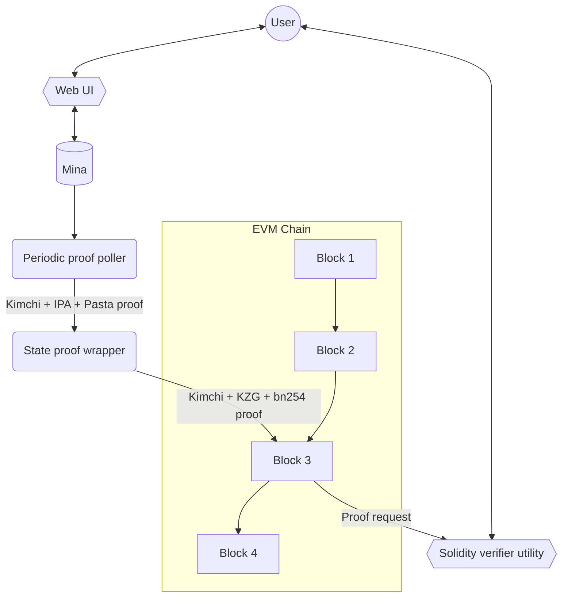

<div align="center">

# mina_bridge 🌉

### Zero-knowledge state bridge from Mina to Ethereum

</div>

## About

This project introduces the proof generation, posting and verification of the validity of [Mina](https://minaprotocol.com/) states into a EVM chain, which will serve as a foundation for token bridging.

## Design objectives

`mina_bridge` will include:

1. Backend service for periodically wrapping and posting Mina state proofs to an EVM chain.
2. A “wrapping” module for Mina state proofs to make them efficient to verify on the EVM.
3. The solidity logic for verifying the wrapped Mina state proofs on a EVM chain.
4. Browser utility for smart contract users: Mina address is provided as an input. State is looked up against Mina and then shared as a Mina state lookup-merkle-proof wrapped inside an efficient proof system.
5. A solidity contract utility that smart contract developers or users can execute on an EVM chain to feed in a Mina state lookup proof that will check the state lookup against the latest posted Mina state proof to verify that this Mina state is valid.

## Disclaimer

`mina_bridge` is in an early stage of development, currently it misses elemental features and correct functionality is not guaranteed.

### Elliptic Curve operations

The algorithms for multiplication of points of an elliptic curve that we implemented using the building blocks present in `o1js` are very slow 🐢.
So we need to implement the bindings to use the native Ocaml libraries for the elliptic curve operations called in o1js. At the time of this text is written, we are still working on this 🚧.

## Architecture

This is subject to change.



## Usage

On root folder run:

```sh
make
```

This will:

- Invoke the polling service and query the last Mina chain state and a Pasta+IPA proof, then send both to the `public_input_gen/` crate.
- This crate will compute needed data (SRS, public inputs) for feeding the state profo into an o1js verifier circuit.
- The circuit will verify the proof and output the gate system to a KZG prover.
- The KZG prover will generate another proof (BN254+KZG) of this verification. This makes it suitable to verify in an Ethereum smart contract. The final proof including the embedded state will be sent to the Solidity verifier.
- The verifier will be deployed in Anvil (a local test blockchain) and a bash script will send a transaction with the state+proof data for running the final verification. If successful, the contract will store the state data and will expose an API for the user to retrieve it, knowing that this data was zk-verified.


## Components of this Repo

This repository is composed of the following components:

### Verifier circuit

This module contains the [o1js](https://github.com/o1-labs/o1js) circuit used for recursively verify Mina state proofs.
A proof of the circuit will be constructed in subsequent modules for validating the state.

The code is written entirely in Typescript using the [o1js](https://github.com/o1-labs/o1js) library and is heavily based on [Kimchi](https://github.com/o1-labs/proof-systems/tree/master/kimchi)'s original verifier implementation.

#### Running

On `verifier_circuit/` run:

```sh
make
```

This will create the constraint system of the verification of a proof with fixed values.
This will also clone the Monorepo version of Mina so that the bridge uses o1js from there.

#### Testing

```bash
npm run test
npm run testw # watch mod
```

will execute Jest unit and integration tests of the module.

#### Structure

- `poly_commitment/`: Includes the `PolyComm` type and methods used for representing a polynomial commitment.
- `prover/`: Proof data and associated methods necessary to the verifier. The Fiat-Shamir heuristic is included here (`ProverProof.oracles()`).
- `serde/`: Mostly deserialization helpers for using data from the `verifier_circuit_tests/` module, like a proof made over a testing circuit.
- `util/`: Miscellaneous utility functions.
- `verifier/`: The protagonist code used for verifying a Kimchi + IPA + Pasta proof. Here:
    - `batch.ts/` includes the partial verification code used for verifying a batch of proofs.
    - `verifier.ts/` has the main circuit for verification, currently executes a minimal final verification over a batch of partially verified proofs.
    - `sponge.ts/` has a custom sponge implementation which extends the `Poseidon.Sponge` type from [o1js](https://github.com/o1-labs/o1js).
- `test/`: JSON data used for testing, which are derived from the `verifier_circuit_tests/`.
- `SRS.ts` contains a type representing a [Universal Reference String](https://o1-labs.github.io/proof-systems/specs/urs.html?highlight=universal#universal-reference-string-urs) (but uses the old Structured Reference String name).
- `polynomial.ts` contains a type used for representing and operating with polynomials.
- `alphas.ts` contains a type representing a mapping between powers of a challenge (alpha) and different constraints. The linear combination resulting from these two will get you the
main polynomial of the circuit.
- `main.ts` is the main entrypoint of the module.

#### Batch verification

The arguments are the *verifier_index*, *proof* and *public inputs*. The output is a "batch evaluation proof".

The steps are the following:
- Check the length of evaluations inside the proof.
- Commit to the negated public input polynomial.
- Run the Fiat-Shamir heuristic  ([non-interaction with fiat-shamir](https://o1-labs.github.io/proof-systems/plonk/fiat_shamir.html?highlight=fiat%20shamir#non-interaction-with-fiat-shamir)).
- Combine the chunked polynomials' evaluations.
- Compute the commitment to the linearized polynomial $f$ by adding all constraints, in commitment form or evaluation if not present.
- Compute the (chuncked) commitment of $ft$ [see Maller’s optimization](https://o1-labs.github.io/proof-systems/plonk/maller.html) .
- List the polynomial commitments, and their associated evaluations, that are associated to the aggregated evaluation proof in the proof.

### Verifier circuit tests

Contains a Rust crate with Kimchi as a dependency, and runs some components of it generating data for feeding and comparing tests inside the verifier circuit.

For executing the main integration flow, do:

```bash
cargo run
```

this will run the verification of a test circuit defined in Kimchi and will export some JSON data into `verifier_circuit/src/test`.

For executing unit tests, do:

```bash
cargo test -- --nocapture
```

this will execute some unit tests and output results that can be used as reference value in analogous reference tests inside the verifier circuit.

### Ethereum smart contract verifier

`eth_verifier/` holds the Mina state verifier in solidity, implemented using [Foundry](https://book.getfoundry.sh/). The contract exposes an API for retrieving zk-verified data from the last Mina state.

Install dependencies by running:
```bash
make setup
```

#### Local usage and deployment
The contract will be deployed and verification should execute after running the whole project workflow (executing `make` in the root) to query, parse and serialize the last Mina state data and proof.

To make this manually, you can follow the next steps. Files `proof.mpk` and `state.mpk` should be present in `eth_verifier/` for this.

Start the local chain with:
```bash
make run_node
```
and then deploy and verify the data:
```bash
make deploy_and_verify
```
after deployment Anvil will return a list of deployed contracts, as it will also deploy needed libraries for the verifier:
```bash
...

##### anvil-hardhat
✅  [Success]Hash: 0x312036beb087e610e6ba100a1ef0653c31c28db4a924aee13e6550a4181a31ed
Contract Address: 0x67d269191c92Caf3cD7723F116c85e6E9bf55933
Block: 17
Paid: 0.005753394722296 ETH (1825720 gas * 3.1513018 gwei)


Transactions saved to: eth_verifier/broadcast/Deploy.s.sol/31337/run-latest.json

Sensitive values saved to: eth_verifier/cache/Deploy.s.sol/31337/run-latest.json
```
the last contract deployed is the verifier, its address can be used for interacting with the contract. Check if verification was successful by running:
```bash
cast call <CONTRACT_ADDR> 'is_state_available()(bool)'
```
if `true`, then you can get State data from the contract storage:
```bash
cast call <CONTRACT_ADDR> 'retrieve_state_creator()(string)'
cast call <CONTRACT_ADDR> 'retrieve_state_hash()(uint256)'
cast call <CONTRACT_ADDR> 'retrieve_state_height(uint256)'
```
#### Testing

Just run:
```bash
make test
```
#### Notes related to cast usage

- For invoking non-view functions in the contract, it's needed to publish a transaction via `cast send`. Getter functions can be invoked with `cast call`.
- Some commands may require you to encode the calldata before sending. In this case you can use `cast calldata`.

For more information on Ethereum transactions and encoding you can visit the following resources:

- [ABI Specification](https://docs.soliditylang.org/en/develop/abi-spec.html)
- [A Step-by-Step Guide to Generating Raw Ethereum Transactions](https://medium.com/@LucasJennings/a-step-by-step-guide-to-generating-raw-ethereum-transactions-c3292ad36ab4)
- [Transaction Calldata Demystified - A Guide to Understanding Transaction Calldata on Ethereum](https://www.quicknode.com/guides/ethereum-development/transactions/ethereum-transaction-calldata)

## Other components
- `kzg_prover`: Rust code for generating a KZG proof. This proof is used in the `eth_verifier`.
- `public_input_gen/`: Rust code for generating a Mina state proof. This proof is used in the `verifier_circuit`.
- `srs/`: Contains tests SRSs for Pallas and Vesta curves.
- `test_prover/`: Typescript code using `o1js` library. This is a test prover for the Kimchi proof system. It's a PoC and will be removed in the near future.

## Kimchi proving system

Kimchi is a zero-knowledge proof system that’s a variant of PLONK.

Kimchi represents a series of enhancements, optimizations, and modifications implemented atop PLONK. To illustrate, it addresses PLONK's trusted setup constraint by incorporating a polynomial commitment in a bulletproof-style within the protocol. In this manner, there's no necessity to rely on the honesty of the participants in the trusted setup.

Kimchi increases PLONK's register count from 3 to 15 by adding 12 registers.
With an increased number of registers, Kimchi incorporate gates that accept multiple inputs, as opposed to just two. This unveils new opportunities; for instance, a scalar multiplication gate would necessitate a minimum of three inputs—a scalar and two coordinates for the curve point.

New proof systems resembling PLONK employ custom gates to efficiently represent frequently used functionalities, as opposed to connecting a series of generic gates. Kimchi is among these innovative protocols.

In Kimchi, there's a concept where a gate has the ability to directly record its output onto the registers utilized by the subsequent gate.

Another enhancement in Kimchi involves the incorporation of lookups for performance improvement. Occasionally, certain operations can be expressed in a tabular form, such as an XOR table.

In the beginning, Kimchi relies on an interactive protocol, which undergoes a conversion into a non-interactive form through the Fiat-Shamir transform.

### Proof Construction & Verification

#### Secuence diagram linked to ``proof-systems/kimchi/src/verifier.rs``


Links to the associated code.

[public input & witness commitment](https://github.com/o1-labs/proof-systems/blob/17041948eb2742244464d6749560a304213f4198/kimchi/src/verifier.rs#L134)

[beta](https://github.com/o1-labs/proof-systems/blob/17041948eb2742244464d6749560a304213f4198/kimchi/src/verifier.rs#L196)

[gamma](https://github.com/o1-labs/proof-systems/blob/17041948eb2742244464d6749560a304213f4198/kimchi/src/verifier.rs#L199)

[permutation commitment](https://github.com/o1-labs/proof-systems/blob/17041948eb2742244464d6749560a304213f4198/kimchi/src/verifier.rs#L206)

---


Links to the associated code.

[alpha](https://github.com/o1-labs/proof-systems/blob/17041948eb2742244464d6749560a304213f4198/kimchi/src/verifier.rs#L213)

[quotient commitment](https://github.com/o1-labs/proof-systems/blob/17041948eb2742244464d6749560a304213f4198/kimchi/src/verifier.rs#L221)

---


Links to the associated code.

[zeta](https://github.com/o1-labs/proof-systems/blob/17041948eb2742244464d6749560a304213f4198/kimchi/src/verifier.rs#L227)

[change of sponge](https://github.com/o1-labs/proof-systems/blob/17041948eb2742244464d6749560a304213f4198/kimchi/src/verifier.rs#L234)

[recursion challenges](https://github.com/o1-labs/proof-systems/blob/17041948eb2742244464d6749560a304213f4198/kimchi/src/verifier.rs#L236)

---


Links to the associated code.

[zeta](https://github.com/o1-labs/proof-systems/blob/17041948eb2742244464d6749560a304213f4198/kimchi/src/verifier.rs#L227)

[negated public input](https://github.com/o1-labs/proof-systems/blob/17041948eb2742244464d6749560a304213f4198/kimchi/src/verifier.rs#L290)

[15 register/witness - 6 sigmas evaluations](https://github.com/o1-labs/proof-systems/blob/17041948eb2742244464d6749560a304213f4198/kimchi/src/verifier.rs#L323)

---


Links to the associated code.

TODO

---


Links to the associated code.

[v,u](https://github.com/o1-labs/proof-systems/blob/17041948eb2742244464d6749560a304213f4198/kimchi/src/verifier.rs#L334)

[polynomials that have an evaluation proof](https://github.com/o1-labs/proof-systems/blob/17041948eb2742244464d6749560a304213f4198/kimchi/src/verifier.rs#L346)

---

## Pickles - Mina’s inductive zk-SNARK composition system

To efficiently provide incremental verifiable computation, Pickles employs a set of friendly curves known as Pasta.
Within the Mina source code, these curves are denoted as "tick" and "tock."

- Tick - Vesta (a.k.a. Step), constraint domain size 2¹⁸  [block and transaction proofs]
- Tock - Pallas (a.k.a. Wrap), constraint domain size 2¹²  [signatures]

The Tock prover undertakes a more limited role, exclusively engaging in recursive verifications without involving other logical processes. As a result, it necessitates fewer constraints and operates within a more compact domain size. Within Pickles' internal terminology, Tick is denoted as _Step_, and Tock is referred to as _Wrap_.

Tock is used to prove the verification of a Tick proof and outputs a Tick proof. Tick is used to prove the verification of a Tock proof and outputs a Tock proof.

- Prove<sub>tock</sub> ( Verify(_Tick_) ) = Tick<sub>proof</sub>

- Prove <sub>tick</sub> (Verify(_Tock_) ) = Tock<sub>proof</sub>
​
---

Analysis of the Induction (recursion) method applied in Pickles. Then the original HALO2 will be analyzed.

The __Verifier__ is divided into 2 modules, one part __Slow__ and one part __Fast__.


__S0__ is the initial statement, __U__ is the Update algorithm, the __Pi__ are the proofs, and the __S's__ are the updated statements.


On top of each __Pi__ proof, we run a __Fast__ verifier. With the __Pi__ proof and the cumulative Statement from the previous step, the __U__ algorithm is applied and a new updated Statement is created. This _new updated Statement_ is the input of the Slow part of the Verifier, but we don't run the Slow Verifier until we reach the end of the whole round.

---
Execution of __Verifier Slow__ (which is very slow) can be <ins>deferred</ins> in sequences, and the V slow current always accumulates to the previous statement. This implicitly 'runs Vs on S1' as well.

---

Remember that the S's are statements that accumulate, so each one has information from the previous ones.


When we reached the last round we see that the intermediate Verifiers Slow disappears, as they are no longer useful to us.


Attention!! We haven't executed any Verifier Slow yet; we only run Verifier Fast in each round.

Therefore, in the last step, we execute the current **Verifier Fast** on its Pi, and the **Last Verifier Slow** on the **Final S**. This may take 1 second, but it accumulates all the previous ones.


---

Everything inside the large red square in the following figure has already been processed by the time we reach the last round.


---

Let's now see how the Verifier Fast is divided.


__Vf__ corresponds to field operations in a field __F__, and __Vg__ corresponds to group operations in a group __G__.


The proof __Pi__ is divided into 2 parts, one corresponding to group operations __G__, and it exposes, as a public input to the circuit, the part of the proof that is necessary to execute __Vf__.

---

# Consensus

Mina employs [Ouroboros Samasika](https://eprint.iacr.org/2020/352.pdf) as its consensus mechanism, which will be subsequently denoted as Samasika.
Three essential commitments provided include:
- High decentralization - Self-bootstrap, uncapped participation and dynamic availability
- Succinctness - Constant-time synchronization with full-validation and high interoperability
- Universal composability - Proven security for interacting with other protocols, no slashing required

Joseph Bonneau, Izaak Meckler, Vanishree Rao, and Evan Shapiro collaborated to create Samasika, establishing it as the initial succinct blockchain consensus algorithm.  
The complexity of fully verifying the entire blockchain is independent of chain length.  
Samasika takes its name from the Sanskrit term, meaning small or succinct.

### Chain selection rules

Samasika uses two consensus rules: one for _short-range forks_ and one for _long-range forks_.

#### Short-range fork rule
This rule is triggered whenever the fork is such that the adversary has not yet had the opportunity to mutate the block density distribution.  
A fork is considered short-range if it took place within the last **m** blocks. The straightforward implementation of this rule involves consistently storing the most recent **m** blocks. Yet, in the context of a succinct blockchain, this is considered not desirable. Mina Samasika follows a methodology that necessitates information about only two blocks, the concept involves a decentralized checkpointing algorithm.

#### Long-range fork rule

When a malicious actor generates an long-range fork, it gradually distorts the leader selection distribution, resulting in a longer adversarial chain. At the start, the dishonest chain will have a reduced density, but eventually, the adversary will work to elevate it. Therefore, the only factor we can depend on is the variation in density in the initial slots after the fork, which is known as the _critical window_.  
The reasoning is that the critical window of the honest chain is very likely to have a higher density because this chain has the most stake

#### Decentralized checkpointing
Samasika employs decentralized checkpointing to discern the nature of a fork, categorizing it as either short-range or long-range.
- **Start checkpoint** - State hash of the first block of the epoch.
- **Lock checkpoint** - State hash of the last known block in the seed update range of an epoch (not including the current block) 

Remember, a fork is categorized as short-range if either:
- The fork point of the candidate chains are in the same epoch.
- The fork point is in the previous epoch with the same ``lock_checkpoint``

As Mina prioritizes succinctness, it implies the need to maintain checkpoints for both the current and the previous epoch.


#### Short-range fork check
As Mina prioritizes succinctness, it implies the need to maintain checkpoints for both the current and the previous epoch.  
Keep in mind that short-range forks occur when the fork point occurs after the lock_checkpoint of the previous epoch; otherwise, it qualifies as a long-range fork.  
The position of the previous epoch is a measurement relative to a block's perspective. In cases where candidate blocks belong to distinct epochs, each will possess distinct current and previous epoch values.  
Alternatively, if the blocks belong to the same epoch, they will both reference the identical previous epoch. Thus we can simply check whether the blocks have the same lock_checkpoint in their previous epoch data.

#### Sliding window density
Let describe Mina's succinct sliding window density algorithm used by the long-range fork rule. In detail how windows are represented in blocks and how to compute _minimum window density_

##### Nomenclature

- We say a slot is _filled_ if it contains a valid non-orphaned block.
- An _w-window_ is a sequential list of slots s1,...,sw of length _w_.
- A _sub-window_ is a contiguous interval of a _w-window_.
- The _density_ of an w-window (or sub-window) is the number non-orphan block within it.
- We use the terms _window_, _density window_, _sliding window_ and _w-window_ synonymously.
- v is the Length by which the window shifts in slots (shift parameter).  ``slots_per_sub_window``
- w is the Window length in slots.  ( the sliding window is a _w_-long window that shifts _v_-slots at a time).

The Samasika research paper presents security proofs that determine the secure values for v, w, and sub-windows per window.  
A sliding window can also be viewed as a collection of _sub-windows_.  
Rather than storing a window as clusters of slots, Samasika focuses solely on the density of each sub-window.  
The density of a window is computed as the sum of the densities of its sub-windows.

Given a window ``W`` that is a list of sub-window densities, the window density is: ``density(W) = sum(W)``

##### Window structure

We use the phrase "window at sub-window _s_" to refer to the window _W_ whose most recent global sub-window is _s_.  
In the Samasika paper the window structure actually consists of the **11 previous sub-window densities**, the **current sub-window density** and the **minimum window density** .A total of _13_ densities.  
The most recent sub-window may be a previous sub-window or the current sub-window.  

##### Minimum window density
The **minimum window density** at a given slot is defined as the minimum window density observed over all previous sub-windows and previous windows, all the way back to genesis.  
When a new block _B_ with parent _P_ is created, the minimum window density is computed like this.  
``B.min_window_density = min(P.min_window_density, current_window_density)``  
where ``current_window_density`` is the density of _B's_ projected window

The relative sub-window _i_ of a sub-window _sw_ is its index within the window.

##### Ring-shift
When we shift a window ``[d0, d1, ..., d10]`` in order to add in a new sub-window ``d11``, we could evict the oldest sub-window d0 by shifting down all of the other sub-windows. Unfortunately, shifting a list in a SNARK circuit is very expensive.  
It is more efficient (and also equivalent) to just replace the sub-window we wish to evict by overwriting it with the new sub-window, like this:
 ``sub_window_densities: d11 | d1 | d2 | d3 | d4 | d5 | d6 | d7 | d8 | d9 | d10``

##### Projected window

Generating a new block and determining the optimal chain in accordance with the long-range fork rule involve the computation of a projected window.  
Given a window _W_ and a future global slot _next_, the projected window of _W_ to slot _next_ is a transformation of _W_ into what it would look like if it were positioned at slot _next_.  
For example, when a new block _B_ is produced with parent block _P_, the height of _B_ will be the height of _P_ plus one, but the global slot of _B_ will depend on how much time has elapsed since _P_ was created.  
According to the Samasika paper, the window of _B_ must be initialized based on _P's_ window, then shifted because _B_ is ahead of _P_ and finally the value of _B's_ sub-window is incremented to account for _B_ belonging to it.  
Remember that the calculation of window density, including sub-window s, only occurs when the sub-window is greater than s, after s becomes a previous sub-window. 
Therefore, if _next_ is **k** sub-windows ahead of _W_ we must shift only **k - 1** times because we must keep the most recent previous sub-window.

Now that we know how much to ring-shift, the next question is what density values to shift in. Remember that when projecting W to global slot next, we said that there are no intermediate blocks. That is, all of the slots and sub-windows are empty between W's current slot and next. Consequently, we must ring-shift in zero densities. The resulting window W is the projected window.

Recall this diagram:

Suppose window W's current sub-window is 11 whose density is d11 and d1 is the oldest sub-window density

Now imagine we want to project W to global slot ``next = 15``. This is ``k = 15 - 11 = 4`` sub-windows ahead of the most recent sub-window. Therefore, we compute ``shift_count = min(max(k - 1, 0), sub_windows_per_window)``  in this case: ``shift_count = min(max(4 - 1, 0), 11) = 3``

Ring-shift in 3 zero densities to obtain the projected window.


We can derive some instructive cases from the general rule 


##### Genesis window

Anything related to Genesis windows is not involved in the Mina Bridge.

##### Relative minimum window density

When Mina engages "chain selection" in the long-range fork rule, It doesn't directly employ the minimum window densities found in  in the current and candidate blocks.  
Rather than that, Mina opts for the relative minimum window density...

Remember that the minimum window density consistently decreases. Consequently, if a peer has been offline for a while and wants to reconnect, their current best chain might exhibit a higher minimum window density compared to the canonical chain candidate.
Additionally, the long-range fork rule dictates that the peer to choose the chain with the superior minimum density.  
The calculation of the minimum window density does not take into account the relationship between the current best chain and the canonical chain with respect to time.  
Within Samasika, time is encapsulated and safeguarded by the notions of slots and the VRF. When computing the minimum window density, it is imperative to factor in these elements as well.  
The relative minimum window density solves this problem by projecting the joining peer's current block's window to the global slot of the candidate block.  

## Protocol
This section outlines the consensus protocol in terms of events. **Initialize consensus** and **Select chain**. 

In the following description, dot notation is used to refer to the local data members of peers. For example, given peer P, we use P.genesis_block and P.tip, to refer to the genesis block and currently selected chain, respectively.  
For example, given peer ``P``, we use ``P.genesis_block`` and ``P.tip``, to refer to the genesis block and currently selected chain, respectively.

### Initialize consensus
Things a peer MUST do to initialize consensus includes are _Load the genesis block_, _Get the tip_, _Bootstrap_ and _Catchup_  
Bootstrapping consensus requires the ability to synchronize epoch ledgers from the network.  
All peers MUST have the ability to load both the staking epoch ledger and next epoch ledger from disk and by downloading them. P2P peers MUST also make these ledgers available for other peers.  

### Select chain
Each time a peer's chains receive an update, the select chain event takes place.  
A chain is said to be updated anytime a valid block is added or removed from its head. The chain selection algorithm also incorporates certain tiebreak logic.  
Supplementary tiebreak logic becomes necessary when assessing chains with identical length or equal minimum density.

Let ``P.tip`` refer to the top block of peer ``P``'s current best chain. Assuming an update to either ``P.tip`` or ``P.chains``, ``P`` must update its tip similar to this:


The following selectSecureChain algorithm receives the peer's current best chain P.tip and its set of known valid chains P.chains and produces the most secure chain as output.  


And the ``selectLongerChain`` algorithm:


### Maintaining the k-th predecessor epoch ledger
The staking and next epoch ledgers MUST be finalized ledgers and can only advance when there is sufficient depth to achieve finality.  
The staking and next epoch ledgers must be in a finalized state and can progress only when there is enough depth to ensure finality. Peers are required to retain the epoch ledger of the k-th predecessor from the tip, where ``k`` represents the depth of finality.  
Due to the security prerequisites of Ouroboros, the gap in slots between the staking and next epoch ledgers may be great. Consequently, at any given moment, we essentially have three "pointers": staking ``s``, next ``n``, and finality ``k``.  
The ``final_ledger`` (epoch ledger of the k-th predecessor from the tip) is updated each time chain selection occurs, i.e., for every new tip block appended.  

### Getting the tip
For a joining peer to discover the head of the current chain it MUST not only obtain the tip, but also the min(k, tip.height - 1)-th block back from the tip. For the latter the peer MUST check the block's proof of finality.  
Peers perform the proof of finality check by verifying two zero-knowledge proofs, one for the _tip_ and one for the _root_, and a Merkle proof for the chain of protocol state hashes between them.


