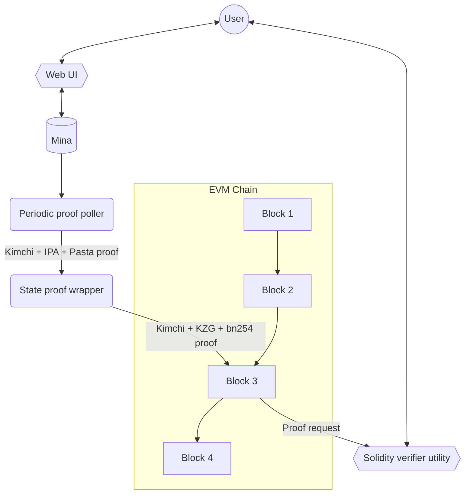

<div align="center">

# mina_bridge 🌉

### Zero-knowledge state bridge from Mina to Ethereum

</div>

## About

This project introduces the proof generation, posting and verification of the validity of [Mina](https://minaprotocol.com/) states into a EVM chain, which will serve as a foundation for token bridging.

## Design objectives

`mina_bridge` will include:

1. Backend service for periodically wrapping and posting Mina state proofs to an EVM chain.
2. A “wrapping” module for Mina state proofs to make them efficient to verify on the EVM.
3. The solidity logic for verifying the wrapped Mina state proofs on a EVM chain.
4. Browser utility for smart contract users: Mina address is provided as an input. State is looked up against Mina and then shared as a Mina state lookup-merkle-proof wrapped inside an efficient proof system.
5. A solidity contract utility that smart contract developers or users can execute on an EVM chain to feed in a Mina state lookup proof that will check the state lookup against the latest posted Mina state proof to verify that this Mina state is valid.

## Disclaimer

`mina_bridge` is in an early stage of development, currently it misses elemental features and correct functionality is not guaranteed.

## Architecture

This is subject to change.



## Components of this Repo

This repository is composed of the following components:

- [`verifier_circuit/`](verifier_circuit/README.md): Typescript code using `o1js` library. This is the main code of the Mina <-> EVM bridge. Implements the circuits for the verifier of the Kimchi proof system in arthmetic circuits, and generates the proof for the EVM (this is a WIP, as the proof is not yet generated).
- `kzg_prover`: Rust code for generating a KZG proof. This proof is used in the `verifier_circuit`.
- `public_input_gen/`: Rust code for generating a Mina state proof. This proof is used in the `verifier_circuit`.
- `srs/`: Contains tests SRSs for Pallas and Vesta curves.
- `test_prover/`: Typescript code using `o1js` library. This is a test prover for the Kimchi proof system. It's a PoC and will be removed in the near future.

## Usage

### Generate public inputs

On `public_input_gen/` run:

```sh
cargo r --release
```

This will generate the proof and the expected value (in the completed version, this value would be the point at infinity). These values will be used as public inputs for the verifier circuit.

### Run the Verifier circuit

On `verifier_circuit/` run:

```sh
make
```

This will create the constraint system of the verification of a proof with fixed values.
This will also clone the Monorepo version of Mina so that the bridge uses o1js from there.

## Kimchi proving system

Kimchi is a zero-knowledge proof system that’s a variant of PLONK.

Kimchi represents a series of enhancements, optimizations, and modifications implemented atop PLONK. To illustrate, it addresses PLONK's trusted setup constraint by incorporating a polynomial commitment in a bulletproof-style within the protocol. In this manner, there's no necessity to rely on the honesty of the participants in the trusted setup.

Kimchi increases PLONK's register count from 3 to 15 by adding 12 registers.
With an increased number of registers, Kimchi incorporate gates that accept multiple inputs, as opposed to just two. This unveils new opportunities; for instance, a scalar multiplication gate would necessitate a minimum of three inputs—a scalar and two coordinates for the curve point.

New proof systems resembling Plonk employ custom gates to efficiently represent frequently used functionalities, as opposed to connecting a series of generic gates. Kimchi is among these innovative protocols.

In Kimchi, there's a concept where a gate has the ability to directly record its output onto the registers utilized by the subsequent gate.

Another enhancement in Kimchi involves the incorporation of lookups for performance improvement. Occasionally, certain operations can be expressed in a tabular form, such as an XOR table.

In the beginning, Kimchi relies on an interactive protocol, which undergoes a conversion into a non-interactive form through the Fiat-Shamir transform.

### Proof Construction & Verification

#### Secuence diagram linked to ``proof-systems/kimchi/src/verifier.rs``


Links to the associated code.

[public input & witness commitment](https://github.com/o1-labs/proof-systems/blob/17041948eb2742244464d6749560a304213f4198/kimchi/src/verifier.rs#L134)

[beta](https://github.com/o1-labs/proof-systems/blob/17041948eb2742244464d6749560a304213f4198/kimchi/src/verifier.rs#L196)

[gamma](https://github.com/o1-labs/proof-systems/blob/17041948eb2742244464d6749560a304213f4198/kimchi/src/verifier.rs#L199)

[permutation commitment](https://github.com/o1-labs/proof-systems/blob/17041948eb2742244464d6749560a304213f4198/kimchi/src/verifier.rs#L206)

---


Links to the associated code.

[alfa](https://github.com/o1-labs/proof-systems/blob/17041948eb2742244464d6749560a304213f4198/kimchi/src/verifier.rs#L213)

[quotient commitment](https://github.com/o1-labs/proof-systems/blob/17041948eb2742244464d6749560a304213f4198/kimchi/src/verifier.rs#L221)

---


Links to the associated code.

[zeta](https://github.com/o1-labs/proof-systems/blob/17041948eb2742244464d6749560a304213f4198/kimchi/src/verifier.rs#L227)

[change of sponge](https://github.com/o1-labs/proof-systems/blob/17041948eb2742244464d6749560a304213f4198/kimchi/src/verifier.rs#L234)

[recursion challenges](https://github.com/o1-labs/proof-systems/blob/17041948eb2742244464d6749560a304213f4198/kimchi/src/verifier.rs#L236)

---


Links to the associated code.

[zeta](https://github.com/o1-labs/proof-systems/blob/17041948eb2742244464d6749560a304213f4198/kimchi/src/verifier.rs#L25)

[negated public input](https://github.com/o1-labs/proof-systems/blob/17041948eb2742244464d6749560a304213f4198/kimchi/src/verifier.rs#L290)

[15 register/witness - 6 sigmas evaluations](https://github.com/o1-labs/proof-systems/blob/17041948eb2742244464d6749560a304213f4198/kimchi/src/verifier.rs#L323)

---


Links to the associated code.

TODO

---


Links to the associated code.

[v,u](https://github.com/o1-labs/proof-systems/blob/17041948eb2742244464d6749560a304213f4198/kimchi/src/verifier.rs#L334)

[polynomials that have an evaluation proof](https://github.com/o1-labs/proof-systems/blob/17041948eb2742244464d6749560a304213f4198/kimchi/src/verifier.rs#L346)

---

