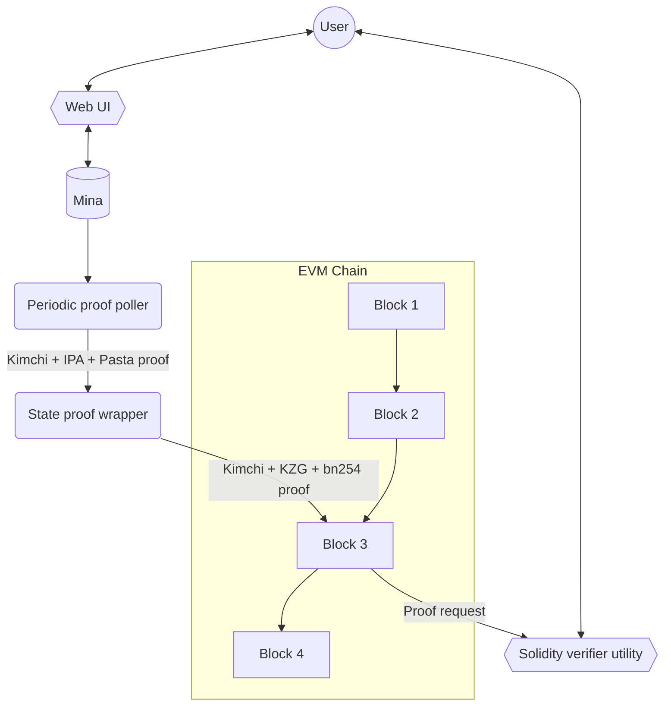

<div align="center">

# mina_bridge 🌉

### Zero-knowledge state bridge from Mina to Ethereum

</div>

## About

This project introduces the proof generation, posting and verification of the validity of [Mina](https://minaprotocol.com/) states into a EVM chain, which will serve as a foundation for token bridging.

## Design objectives

`mina_bridge` will include:

1. Backend service for periodically wrapping and posting Mina state proofs to an EVM chain.
2. A “wrapping” module for Mina state proofs to make them efficient to verify on the EVM.
3. The solidity logic for verifying the wrapped Mina state proofs on a EVM chain.
4. Browser utility for smart contract users: Mina address is provided as an input. State is looked up against Mina and then shared as a Mina state lookup-merkle-proof wrapped inside an efficient proof system.
5. A solidity contract utility that smart contract developers or users can execute on an EVM chain to feed in a Mina state lookup proof that will check the state lookup against the latest posted Mina state proof to verify that this Mina state is valid.

## Disclaimer

`mina_bridge` is in an early stage of development, currently it misses elemental features and correct functionality is not guaranteed.

## Architecture

This is subject to change.



## Components of this Repo

This repository is composed of the following components:

- `evm_bridge/`: Typescript code using `o1js` library. This is the main code of the Mina <-> EVM bridge. Implements the circuits for the verifier of the Kimchi proof system in arthmetic circuits, and generates the proof for the EVM (this is a WIP, as the proof is not yet generated).
- `kzg_prover`: Rust code for generating a KZG proof. This proof is used in the `evm_bridge`.
- `public_input_gen/`: Rust code for generating a Mina state proof. This proof is used in the `evm_bridge`.
- `srs/`: Contains tests SRSs for Pallas and Vesta curves.
- `test_prover/`: Typescript code using `o1js` library. This is a test prover for the Kimchi proof system. It's a PoC and will be removed in the near future.

## Usage

### Generate public inputs

On `public_input_gen/` run:

```sh
cargo r --release
```

This will generate the proof and the expected value (in the completed version, this value would be the point at infinity). These values will be used as public inputs for the verifier circuit.

### Run the Verifier circuit

On `evm_bridge/` run:

```sh
make
```

This will create the constraint system of the verification of a proof with fixed values.
