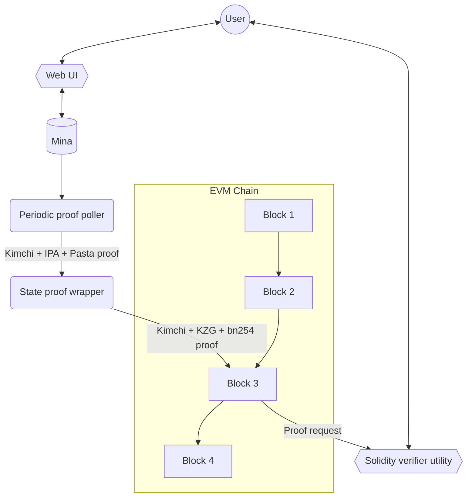

<div align="center">

# mina_bridge 🌉

### Zero-knowledge state bridge from Mina to Ethereum

</div>

## About

This project introduces the proof generation, posting and verification of the validity of [Mina](https://minaprotocol.com/) states into a EVM chain, which will serve as a foundation for token bridging.

## Design objectives

`mina_bridge` will include:

1. Backend service for periodically wrapping and posting Mina state proofs to an EVM chain.
2. A “wrapping” module for Mina state proofs to make them efficient to verify on the EVM.
3. The solidity logic for verifying the wrapped Mina state proofs on a EVM chain.
4. Browser utility for smart contract users: Mina address is provided as an input. State is looked up against Mina and then shared as a Mina state lookup-merkle-proof wrapped inside an efficient proof system.
5. A solidity contract utility that smart contract developers or users can execute on an EVM chain to feed in a Mina state lookup proof that will check the state lookup against the latest posted Mina state proof to verify that this Mina state is valid.

## Disclaimer

`mina_bridge` is in an early stage of development, currently it misses elemental features and correct functionality is not guaranteed.

### Elliptic Curve operations

The algorithms for multiplication of points of an elliptic curve that we implemented using the building blocks present in `o1js` are very slow 🐢.
So we need to implement the bindings to use the native Ocaml libraries for the elliptic curve operations called in o1js. At the time of this text is written, we are still working on this 🚧.

## Architecture

This is subject to change.



## Components of this Repo

This repository is composed of the following components:

### Verifier

### Verifier circuit

This module contains the [o1js](https://github.com/o1-labs/o1js) circuit used for recursively verify Mina state proofs.
A proof of the circuit will be constructed in subsequent modules for validating the state.

The code is written entirely in Typescript using the [o1js](https://github.com/o1-labs/o1js) library and is heavily based on [Kimchi](https://github.com/o1-labs/proof-systems/tree/master/kimchi)'s original verifier implementation.

#### Running

On `verifier_circuit/` run:

```sh
make
```

This will create the constraint system of the verification of a proof with fixed values.
This will also clone the Monorepo version of Mina so that the bridge uses o1js from there.

#### Testing

```bash
npm run test
npm run testw # watch mod
```

will execute Jest unit and integration tests of the module.

#### Structure

- `poly_commitment/`: Includes the `PolyComm` type and methods used for representing a polynomial commitment.
- `prover/`: Proof data and associated methods necessary to the verifier. The Fiat-Shamir heuristic is included here (`ProverProof.oracles()`).
- `serde/`: Mostly deserialization helpers for using data from the `verifier_circuit_tests/` module, like a proof made over a testing circuit.
- `util/`: Miscellaneous utility functions.
- `verifier/`: The protagonist code used for verifying a Kimchi + IPA + Pasta proof. Here:
    - `batch.ts/` includes the partial verification code used for verifying a batch of proofs.
    - `verifier.ts/` has the main circuit for verification, currently executes a minimal final verification over a batch of partially verified proofs.
    - `sponge.ts/` has a custom sponge implementation which extends the `Poseidon.Sponge` type from [o1js](https://github.com/o1-labs/o1js).
- `test/`: JSON data used for testing, which are derived from the `verifier_circuit_tests/`.
- `SRS.ts` contains a type representing a [Universal Reference String](https://o1-labs.github.io/proof-systems/specs/urs.html?highlight=universal#universal-reference-string-urs) (but uses the old Structured Reference String name).
- `polynomial.ts` contains a type used for representing and operating with polynomials.
- `alphas.ts` contains a type representing a mapping between powers of a challenge (alpha) and different constraints. The linear combination resulting from these two will get you the
main polynomial of the circuit.
- `main.ts` is the main entrypoint of the module.

#### Batch verification

The arguments are the *verifier_index*, *proof* and *public inputs*. The output is a "batch evaluation proof".

The steps are the following:
- Check the length of evaluations inside the proof.
- Commit to the negated public input polynomial.
- Run the Fiat-Shamir heuristic  ([non-interaction with fiat-shamir](https://o1-labs.github.io/proof-systems/plonk/fiat_shamir.html?highlight=fiat%20shamir#non-interaction-with-fiat-shamir)).
- Combine the chunked polynomials' evaluations.
- Compute the commitment to the linearized polynomial $f$ by adding all constraints, in commitment form or evaluation if not present.
- Compute the (chuncked) commitment of $ft$ [see Maller’s optimization](https://o1-labs.github.io/proof-systems/plonk/maller.html) .
- List the polynomial commitments, and their associated evaluations, that are associated to the aggregated evaluation proof in the proof.

### Verifier circuit tests

Contains a Rust crate with Kimchi as a dependency, and runs some components of it generating data for feeding and comparing tests inside the verifier circuit.

For executing the main integration flow, do:

```bash
cargo run
```

this will run the verification of a test circuit defined in Kimchi and will export some JSON data into `verifier_circuit/src/test`.

For executing unit tests, do:

```bash
cargo test -- --nocapture
```

this will execute some unit tests and output results that can be used as reference value in analogous reference tests inside the verifier circuit.

### Ethereum smart contract verifier

`eth_verifier/` holds the demo's Mina state verifier in solidity, implemented using [Foundry](https://book.getfoundry.sh/). The contract exposes an API for retrieving zk-verified data from the last Mina state.

Install dependencies by running:
```bash
make setup
```

#### Local usage and deployment
The contract can be deployed in an Anvil local node.

Start the local chain with:
```bash
make run_node
```
then deploy the contract:
```bash
make deploy_verifier
```
after deployment Anvil will return a list of deployed contracts, as it will also deploy needed libraries for the verifier:
```bash
...

##### anvil-hardhat
✅  [Success]Hash: 0x312036beb087e610e6ba100a1ef0653c31c28db4a924aee13e6550a4181a31ed
Contract Address: 0x67d269191c92Caf3cD7723F116c85e6E9bf55933
Block: 17
Paid: 0.005753394722296 ETH (1825720 gas * 3.1513018 gwei)


Transactions saved to: eth_verifier/broadcast/Deploy.s.sol/31337/run-latest.json

Sensitive values saved to: eth_verifier/cache/Deploy.s.sol/31337/run-latest.json
```
the last contract deployed is the verifier, **save its address as we'll use it in a later step**.

You can query data from the last Mina state and serialize it into MessagePack, needed for calling the contract:
```bash
make query
```
building a KZG proof of the state is still WIP, so you can find a `proof.mpk` containing only the data needed for running the current verifier, which is also WIP.

You can then run the verifier by calling the `verify_state()` function using `cast`. For this we provided a utility script `verify.sh`, run it with:
```bash
./verify.sh <ADDRESS>
```
then you can get State data from the contract storage:
```bash
cast call <CONTRACT_ADDR> 'retrieve_state_creator()(string)'
cast call <CONTRACT_ADDR> 'retrieve_state_hash()(uint256)'
cast call <CONTRACT_ADDR> 'retrieve_state_height(uint256)'
````
#### Testing

Just run:
```bash
make test
```
#### Notes related to cast usage

- For invoking non-view functions in the contract, it's needed to publish a transaction via `cast send`. Getter functions can be invoked with `cast call`.
- Some commands may require you to encode the calldata before sending. In this case you can use `cast calldata`.

For more information on Ethereum transactions and encoding you can visit the following resources:

- [ABI Specification](https://docs.soliditylang.org/en/develop/abi-spec.html)
- [A Step-by-Step Guide to Generating Raw Ethereum Transactions](https://medium.com/@LucasJennings/a-step-by-step-guide-to-generating-raw-ethereum-transactions-c3292ad36ab4)
- [Transaction Calldata Demystified - A Guide to Understanding Transaction Calldata on Ethereum](https://www.quicknode.com/guides/ethereum-development/transactions/ethereum-transaction-calldata)

## Other components
- `kzg_prover`: Rust code for generating a KZG proof. This proof is used in the `eth_verifier`.
- `public_input_gen/`: Rust code for generating a Mina state proof. This proof is used in the `verifier_circuit`.
- `srs/`: Contains tests SRSs for Pallas and Vesta curves.
- `test_prover/`: Typescript code using `o1js` library. This is a test prover for the Kimchi proof system. It's a PoC and will be removed in the near future.

## Usage

On root folder run:

```sh
make
```

This will:

- Invoke the polling service and query the last Mina chain state and a Pasta+IPA proof, then send both to the `public_input_gen/` crate.
- This crate will compute needed data (SRS, public inputs) for feeding the state profo into an o1js verifier circuit.
- The circuit will verify the proof and output the gate system to a KZG prover.
- The KZG prover will generate another proof (BN254+KZG) of this verification. This makes it suitable to verify in an Ethereum smart contract. The final proof including the embedded state will be sent to the Solidity verifier.
- The verifier will be deployed in Anvil (a local test blockchain) and a bash script will send a transaction with the state+proof data for running the final verification. If successful, the contract will store the state data and will expose an API for the user to retrieve it, knowing that this data was zk-verified.

## Kimchi proving system

Kimchi is a zero-knowledge proof system that’s a variant of PLONK.

Kimchi represents a series of enhancements, optimizations, and modifications implemented atop PLONK. To illustrate, it addresses PLONK's trusted setup constraint by incorporating a polynomial commitment in a bulletproof-style within the protocol. In this manner, there's no necessity to rely on the honesty of the participants in the trusted setup.

Kimchi increases PLONK's register count from 3 to 15 by adding 12 registers.
With an increased number of registers, Kimchi incorporate gates that accept multiple inputs, as opposed to just two. This unveils new opportunities; for instance, a scalar multiplication gate would necessitate a minimum of three inputs—a scalar and two coordinates for the curve point.

New proof systems resembling PLONK employ custom gates to efficiently represent frequently used functionalities, as opposed to connecting a series of generic gates. Kimchi is among these innovative protocols.

In Kimchi, there's a concept where a gate has the ability to directly record its output onto the registers utilized by the subsequent gate.

Another enhancement in Kimchi involves the incorporation of lookups for performance improvement. Occasionally, certain operations can be expressed in a tabular form, such as an XOR table.

In the beginning, Kimchi relies on an interactive protocol, which undergoes a conversion into a non-interactive form through the Fiat-Shamir transform.

### Proof Construction & Verification

#### Secuence diagram linked to ``proof-systems/kimchi/src/verifier.rs``


Links to the associated code.

[public input & witness commitment](https://github.com/o1-labs/proof-systems/blob/17041948eb2742244464d6749560a304213f4198/kimchi/src/verifier.rs#L134)

[beta](https://github.com/o1-labs/proof-systems/blob/17041948eb2742244464d6749560a304213f4198/kimchi/src/verifier.rs#L196)

[gamma](https://github.com/o1-labs/proof-systems/blob/17041948eb2742244464d6749560a304213f4198/kimchi/src/verifier.rs#L199)

[permutation commitment](https://github.com/o1-labs/proof-systems/blob/17041948eb2742244464d6749560a304213f4198/kimchi/src/verifier.rs#L206)

---


Links to the associated code.

[alpha](https://github.com/o1-labs/proof-systems/blob/17041948eb2742244464d6749560a304213f4198/kimchi/src/verifier.rs#L213)

[quotient commitment](https://github.com/o1-labs/proof-systems/blob/17041948eb2742244464d6749560a304213f4198/kimchi/src/verifier.rs#L221)

---


Links to the associated code.

[zeta](https://github.com/o1-labs/proof-systems/blob/17041948eb2742244464d6749560a304213f4198/kimchi/src/verifier.rs#L227)

[change of sponge](https://github.com/o1-labs/proof-systems/blob/17041948eb2742244464d6749560a304213f4198/kimchi/src/verifier.rs#L234)

[recursion challenges](https://github.com/o1-labs/proof-systems/blob/17041948eb2742244464d6749560a304213f4198/kimchi/src/verifier.rs#L236)

---


Links to the associated code.

[zeta](https://github.com/o1-labs/proof-systems/blob/17041948eb2742244464d6749560a304213f4198/kimchi/src/verifier.rs#L227)

[negated public input](https://github.com/o1-labs/proof-systems/blob/17041948eb2742244464d6749560a304213f4198/kimchi/src/verifier.rs#L290)

[15 register/witness - 6 sigmas evaluations](https://github.com/o1-labs/proof-systems/blob/17041948eb2742244464d6749560a304213f4198/kimchi/src/verifier.rs#L323)

---


Links to the associated code.

TODO

---


Links to the associated code.

[v,u](https://github.com/o1-labs/proof-systems/blob/17041948eb2742244464d6749560a304213f4198/kimchi/src/verifier.rs#L334)

[polynomials that have an evaluation proof](https://github.com/o1-labs/proof-systems/blob/17041948eb2742244464d6749560a304213f4198/kimchi/src/verifier.rs#L346)

---

## Pickles - Mina’s inductive zk-SNARK composition system

To efficiently provide incremental verifiable computation, Pickles employs a set of friendly curves known as Pasta.
Within the Mina source code, these curves are denoted as "tick" and "tock."

- Tick - Vesta (a.k.a. Step), constraint domain size 2¹⁸  [block and transaction proofs]
- Tock - Pallas (a.k.a. Wrap), constraint domain size 2¹²  [signatures]

The Tock prover undertakes a more limited role, exclusively engaging in recursive verifications without involving other logical processes. As a result, it necessitates fewer constraints and operates within a more compact domain size. Within Pickles' internal terminology, Tick is denoted as _Step_, and Tock is referred to as _Wrap_.

Tock is used to prove the verification of a Tick proof and outputs a Tick proof. Tick is used to prove the verification of a Tock proof and outputs a Tock proof.

- Prove<sub>tock</sub> ( Verify(_Tick_) ) = Tick<sub>proof</sub>

- Prove <sub>tick</sub> (Verify(_Tock_) ) = Tock<sub>proof</sub>
​
---

Analysis of the Induction (recursion) method applied in Pickles. Then the original HALO2 will be analyzed.

The __Verifier__ is divided into 2 modules, one part __Slow__ and one part __Fast__.


__S0__ is the initial statement, __U__ is the Update algorithm, the __Pi__ are the proofs, and the __S's__ are the updated statements.


On top of each __Pi__ proof, we run a __Fast__ verifier. With the __Pi__ proof and the cumulative Statement from the previous step, the __U__ algorithm is applied and a new updated Statement is created. This _new updated Statement_ is the input of the Slow part of the Verifier, but we don't run the Slow Verifier until we reach the end of the whole round.

---
Execution of __Verifier Slow__ (which is very slow) can be <ins>deferred</ins> in sequences, and the V slow current always accumulates to the previous statement. This implicitly 'runs Vs on S1' as well.

---

Remember that the S's are statements that accumulate, so each one has information from the previous ones.


When we reached the last round we see that the intermediate Verifiers Slow disappears, as they are no longer useful to us.


Attention!! We haven't executed any Verifier Slow yet; we only run Verifier Fast in each round.

Therefore, in the last step, we execute the current **Verifier Fast** on its Pi, and the **Last Verifier Slow** on the **Final S**. This may take 1 second, but it accumulates all the previous ones.


---

Everything inside the large red square in the following figure has already been processed by the time we reach the last round.


---

Let's now see how the Verifier Fast is divided.


__Vf__ corresponds to field operations in a field __F__, and __Vg__ corresponds to group operations in a group __G__.


The proof __Pi__ is divided into 2 parts, one corresponding to group operations __G__, and it exposes, as a public input to the circuit, the part of the proof that is necessary to execute __Vf__.

